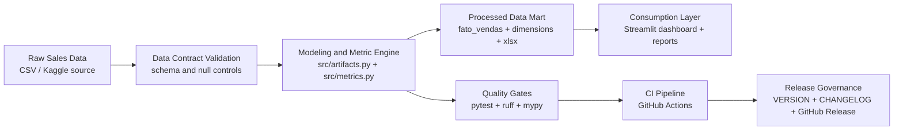

# Sales Analytics Dashboard (International)

[](https://github.com/samuelmaia-analytics/analise-vendas-python/actions/workflows/ci.yml)


Language: [Português (Brasil)](README.pt-BR.md)

## Executive Impact Snapshot

- Converts raw sales records into a decision-ready analytics layer for revenue monitoring.
- Reduces executive reporting friction by centralizing KPIs, YoY trends, and Pareto concentration in one operational view.
- Improves leadership cadence with reproducible outputs (tests + CI + documented data contract).

## Quick Links

- Repository: [samuelmaia-analytics/analise-vendas-python](https://github.com/samuelmaia-analytics/analise-vendas-python)
- CI Workflow: [GitHub Actions - CI](https://github.com/samuelmaia-analytics/analise-vendas-python/actions/workflows/ci.yml)
- Live App: [Streamlit Deploy](https://analys-vendas-python.streamlit.app/)
- LinkedIn: [samuelmaia-analytics](https://linkedin.com/in/samuelmaia-analytics)
- Portuguese README: [README.pt-BR.md](README.pt-BR.md)
- Changelog: [CHANGELOG.md](CHANGELOG.md)
- Version: [VERSION](VERSION)
- Documentation Index: [docs/README.md](docs/README.md)
- Engineering Standards: [docs/engineering_standards.md](docs/engineering_standards.md)
- Architecture: [docs/architecture.md](docs/architecture.md)
- Structure Print View: [docs/print_view.md](docs/print_view.md)
- Data Dictionary: [docs/data_dictionary.md](docs/data_dictionary.md)

## Table of Contents

- [Executive Summary](#executive-summary)
- [Architecture and Pipeline](#architecture-and-pipeline)
- [Engineering Structure](#engineering-structure)
- [Repository Map](#repository-map)
- [Quality Gates](#quality-gates)
- [Quick Start](#quick-start)
- [Automated Tests](#automated-tests)
- [Release Management](#release-management)
- [Governance](#governance)
- [Data Dictionary](#data-dictionary)
- [Dataset Source](#dataset-source)

## Executive Summary

This project is an end-to-end Sales Analytics solution focused on business decision support.

It combines:
- Revenue and growth KPIs
- Pareto concentration analysis
- Monthly Year-over-Year (YoY) tracking
- Interactive Streamlit dashboard

## Architecture and Pipeline



Systemic perspective:
- Data reliability: schema contract and deterministic artifact generation.
- Decision reliability: KPI logic isolated in tested business modules.
- Operational reliability: CI-enforced quality gates and versioned releases.

## Engineering Structure

```text
.
├── app/                       # Streamlit UI layer
├── src/                       # Core business/data logic
├── tests/                     # Automated tests
├── data/
│   ├── raw/                   # Source datasets
│   └── processed/             # Modeled outputs
├── reports/                   # Business-facing artifacts
├── scripts/                   # Utility scripts / CLI workflows
├── .github/workflows/ci.yml   # CI pipeline (ruff + pytest)
├── requirements.txt
├── requirements-dev.txt
└── app.py                     # Entry point
```

Legacy compatibility folders were isolated under `legacy/` and are still supported by fallback paths (`legacy/dados/`, `legacy/dados_processados/`).

## Repository Map

- Application: [app/](app) and [app.py](app.py)
- Core logic: [src/](src)
- Tests: [tests/](tests)
- Data: [data/raw/](data/raw) and [data/processed/](data/processed)
- Utility scripts: [scripts/](scripts)
- Project docs: [docs/](docs) and [reports/](reports)
- CI and templates: [.github/](.github)

## Quality Gates

- Lint: `ruff check .`
- Type check: `mypy src`
- Docs link check: `python scripts/check_markdown_links.py`
- Tests + coverage gate: `pytest` (minimum coverage: 80% in `src`)
- Local hooks: `pre-commit`

## Quick Start

```bash
pip install -e ".[dev]"
cp .env.example .env
pre-commit install
make quality
streamlit run app.py
```

Official CLI commands:

```bash
sales-analytics growth --period M
sales-analytics build-artifacts
```

## Streamlit Cloud Deploy (Stable Config)

- Repository: `samuelmaia-analytics/analise-vendas-python`
- Branch: `main`
- Main file path: `app.py`
- Python version: automatic (or 3.11+)

Notes:
- `app.py` is the official entrypoint and delegates execution to `app/streamlit_app.py`.
- Upload guardrails are configured via `.env` (`MAX_UPLOAD_MB`, `MAX_UPLOAD_ROWS`, `MAX_UPLOAD_COLUMNS`).
- If the app was deleted/recreated, use a new app URL/subdomain.
- After relevant code updates, use `Reboot app` and `Clear cache` in Streamlit Cloud.

## Streamlit Cloud Troubleshooting

- Symptom: black screen / old traceback remains in logs
  - Action: ensure the app is pointing to `main` + `app.py`, then `Reboot app` and `Clear cache`.
- Symptom: upload appears to hang
  - Action: retry with CSV <= 40MB and confirm delimiter (`;` or `,`); parser auto-detect is enabled.
- Symptom: permission/access issues after account rename
  - Action: reconnect GitHub in Streamlit Cloud and re-authorize this repository.

Alternative (Taskfile):

```bash
task quality
```

## Automated Tests

- `tests/test_data_schema.py`: validates raw schema contract
- `tests/test_kpis.py`: validates primary business metrics
- `tests/test_artifacts.py`: validates processed artifact generation

## Release Management

- Current version: `0.3.0` ([VERSION](VERSION))
- Change history: [CHANGELOG.md](CHANGELOG.md)
- Official releases: [GitHub Releases](https://github.com/samuelmaia-analytics/analise-vendas-python/releases)
- Consistency check: `python scripts/check_version_sync.py`
- Release preparation: `python scripts/bump_version.py --part patch` or GitHub Actions `Prepare Release`

## Governance

- Contribution guide: [CONTRIBUTING.md](CONTRIBUTING.md)
- Security policy: [SECURITY.md](SECURITY.md)
- Environment template: [.env.example](.env.example)
- Engineering standards: [docs/engineering_standards.md](docs/engineering_standards.md)
- Architecture decision summary: [docs/architecture.md](docs/architecture.md)
- Project structure print view: [docs/print_view.md](docs/print_view.md)

## Data Dictionary

See [docs/data_dictionary.md](docs/data_dictionary.md).

## Dataset Source

Kaggle - [Sample Sales Data](https://www.kaggle.com/datasets/kyanyoga/sample-sales-data)
